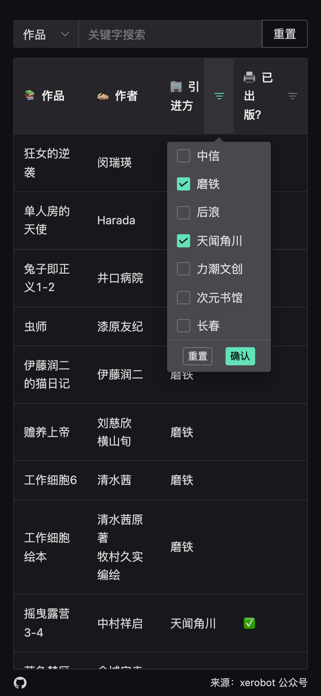

# 2023.4 引进漫画整理

> `Xerobot` 大佬整理了一份[漫画引进公众号文章](https://mp.weixin.qq.com/s/b_r6Cug9UKFD7PAFhK3SRg)，不是很方便检索，就用`nodejs`把表格整理成`json`文件，然后用`element-plus`表格简单展示一下，增加了筛选。

## 更新步骤

1. 浏览器打开[`https://mp.weixin.qq.com/s/b_r6Cug9UKFD7PAFhK3SRg`](https://mp.weixin.qq.com/s/b_r6Cug9UKFD7PAFhK3SRg) 另存网页到`html`目录下

2. 更新`books.json`文件，运行

```sh
# 读取 html 并 parse，最后将表格数据存到 json
npm run format
```

3. 部署

使用`vercel`自动更新网页

## 显示效果



欢迎大家去关注`Xerobot`


